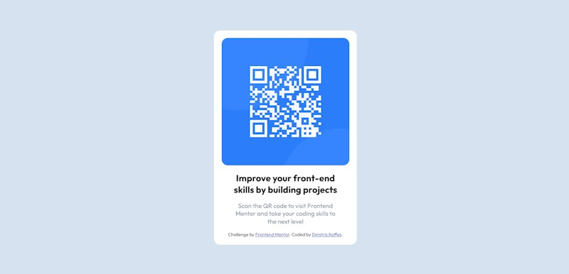

# Frontend Mentor - QR code component solution

This is a solution from Dimitris Kaffes to the [QR code component challenge on Frontend Mentor](https://www.frontendmentor.io/challenges/qr-code-component-iux_sIO_H).

## Table of contents

- [Overview](#overview)
  - [Screenshot](#screenshot)
  - [Links](#links)
- [My process](#my-process)
  - [Built with](#built-with)
  - [What I learned](#what-i-learned)
  - [Continued development](#continued-development)
  - [Useful resources](#useful-resources)
- [Author](#author)

## Overview

The first frontendmentor challenge. HTML and CSS with Flexbox are used to implement the QR-code card component. Media queries are used for the mobile version.
A solution using absolute positioning is also implemented only for the desktop version (`style-2.css`).

### Screenshot



### Links

- Solution URL: [qr-code-component-solution-github](https://github.com/dkaffes/qr-code-component-main)
- Live Site URL: [qr-code-component-live-site](https://dkaffes.github.io/qr-code-component-main/)

## My process

Some basics of the process followed.

### Built with

- Semantic HTML5 markup
- CSS custom properties
- Flexbox

### What I learned

- Meta tags
- Google fonts embedding
- CSS global reset:
  ```css
  * {
    padding: 0;
    margin: 0;
    box-sizing: border-box;
  }
  ```
- Flexbox basics
- How to implement the same result using Flexbox and absolute positioning

### Continued development

- Better use of semantic markup
- Further investigate the use of CSS properties:`width`, `max-width`, `height`, `min-height`, `margin: auto;` and their appropriate values for every use case
- Improve the syntax of media queries

### Useful resources

- [CSS Vertical Align](https://www.freecodecamp.org/news/css-vertical-align-how-to-center-a-div-text-or-an-image-example-code/) - This helped me understand the different methods of CSS vertical aligning.

## Author

- Frontend Mentor - [@dkaffes](https://www.frontendmentor.io/profile/dkaffes)
